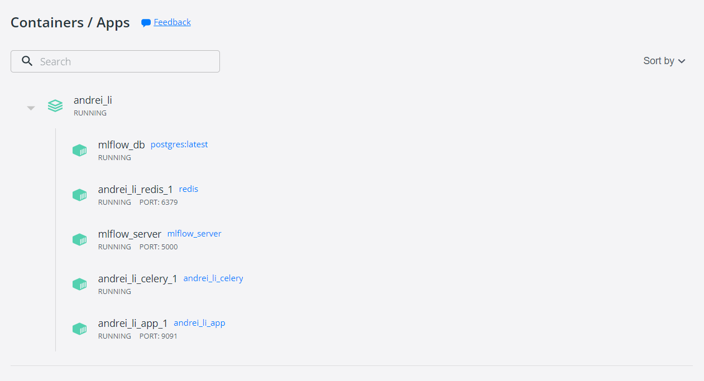

# ML-service to solve Sentiment Analysis

## Dataset 
The data is tweet messages with a sentimental score.
http://cs.stanford.edu/people/alecmgo/trainingandtestdata.zip

## Jupyter
With the help of Google Colab, the initial data was processed, vectorized with the help of Burt (the following tutorial was used https://jalammar.github.io/a-visual-guide-to-using-bert-for-the-first-time/) and the semantic score was predicted using logistic regression. The rmse, mae, r2 metrics were calculated for different parameters. The experiment was registered in MLFlow.

## Architecture
<p align="center">
  
</p>

### Flask
http server with connected to Celery (app conteiner)


### Celery
asynchronous task processing; connected to Flask and MLFlow (port 5000)(celery conteiner)
In file model.py is registered best parameters Logistic Regression c = 10, max_iter = 100 in MLFlow.


### Redis
stores Celery data (redis container)

### MLFlow
track model training (mlflow container)

### DB
Database server for mlflow (db container)

## Build project

To run the whole application, execute the following commands from the project directory: 
 
 ```
 docker-compose up --build
 ```
 
 Then enter in your web browser:  `http://localhost:9091/`

<p align="center">
  
</p>
